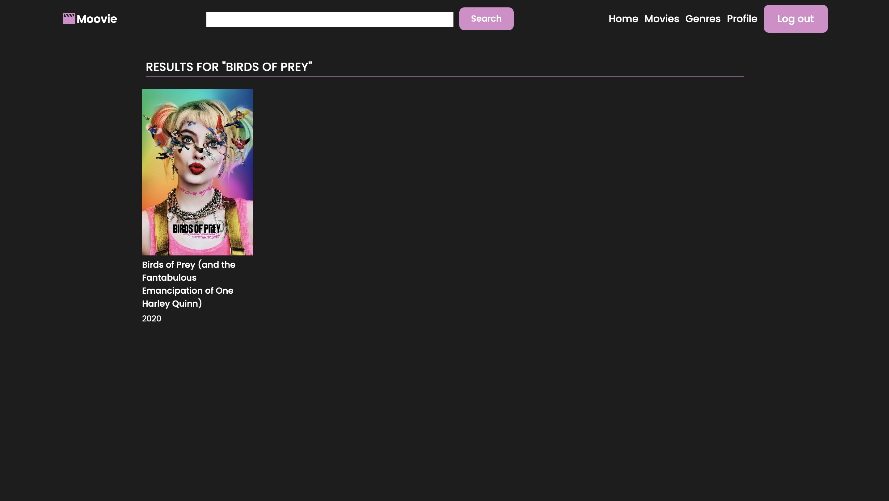
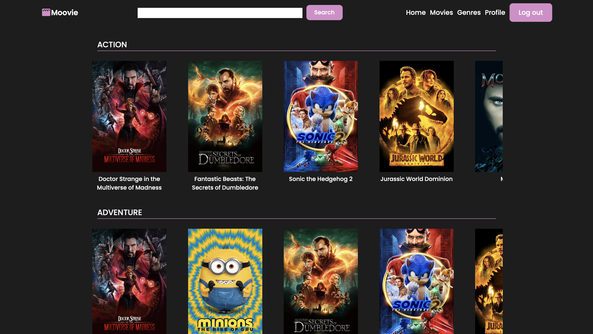
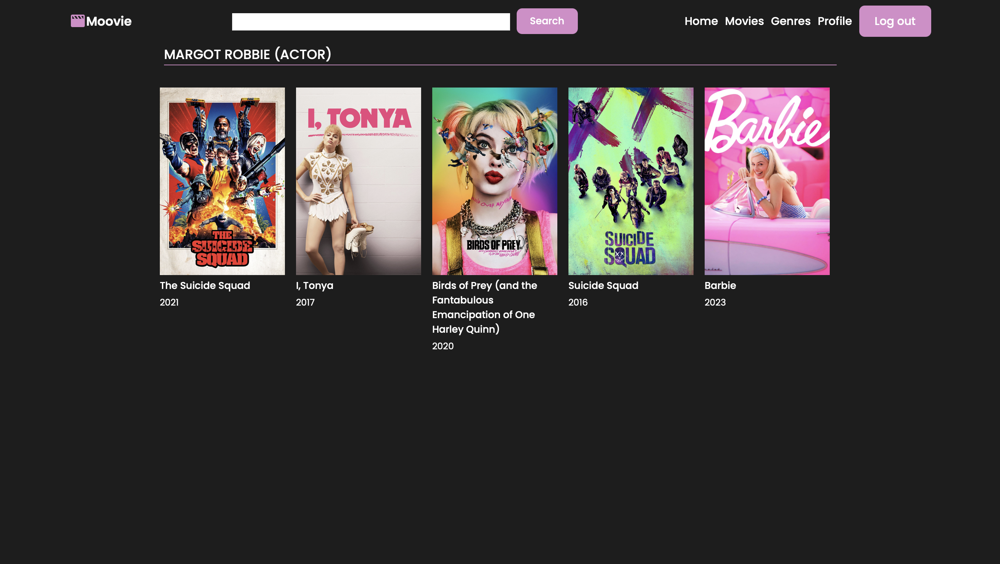
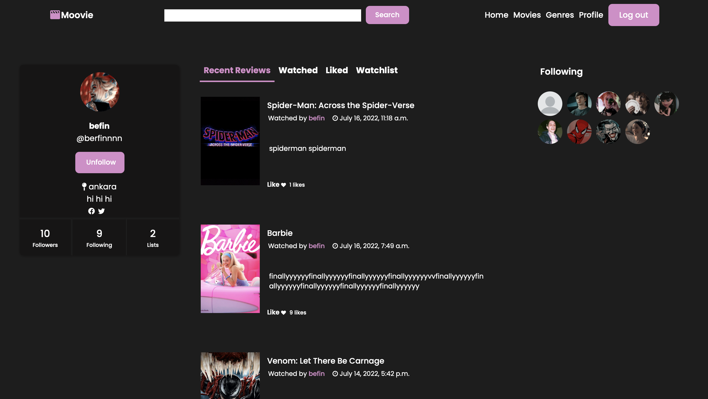
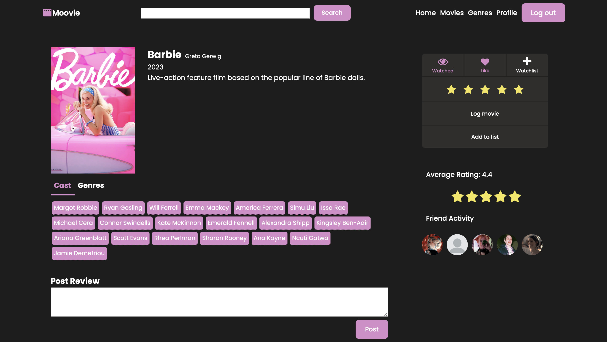
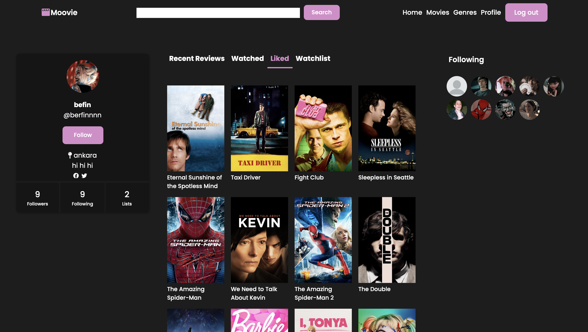
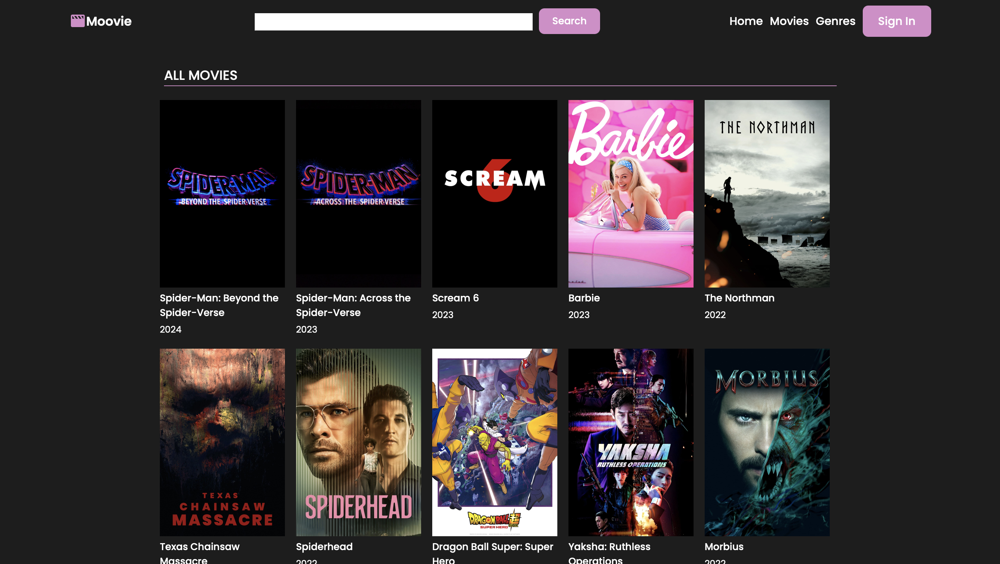

 # Moovie
_Moovie is a web application that allows users to track the films they have watched, review and rate them, discover new films and create watchlists._

## Tech

Moovie uses a number of open source projects to work properly:

- [Python] 
- [Django] - Python web framework
- [HTML] 
- [CSS] 
- [jQuery] - lightweight, "write less, do more" JavaScript library

## Installation

Moovie requires [Python] v3+ to run.

Install the dependencies and start the server.

```sh
pip install -r requirements.txt
python manage.py runserver
```

## Docker

You can also install and deploy Moovie in a Docker container.

By default, the Docker will expose port 8080, so change this within the
Dockerfile if necessary. When ready, simply use the Dockerfile to
build the image.

```sh
cd moovie_app
docker build -t <youruser>/moovie .
```

This will create the Moovie image and pull in the necessary dependencies.

Once done, run the Docker image and map the port to whatever you wish on
your host. Here, we simply map port 8000 of the host to port 8080 of Docker:

```sh
docker run -d -p 8000:8080 --name=moovie <youruser>/moovie
```

Verify the deployment by navigating to your server address in your browser.

```sh
127.0.0.1:8080
```








[//]: # (These are reference links used in the body of this note and get stripped out when the markdown processor does its job.)

   [Python]: <https://www.python.org>
   [Django]: <https://www.djangoproject.com>
   [HTML]: <https://html.com>
   [CSS]: <https://en.wikipedia.org/wiki/CSS>
   [jQuery]: <http://jquery.com>

